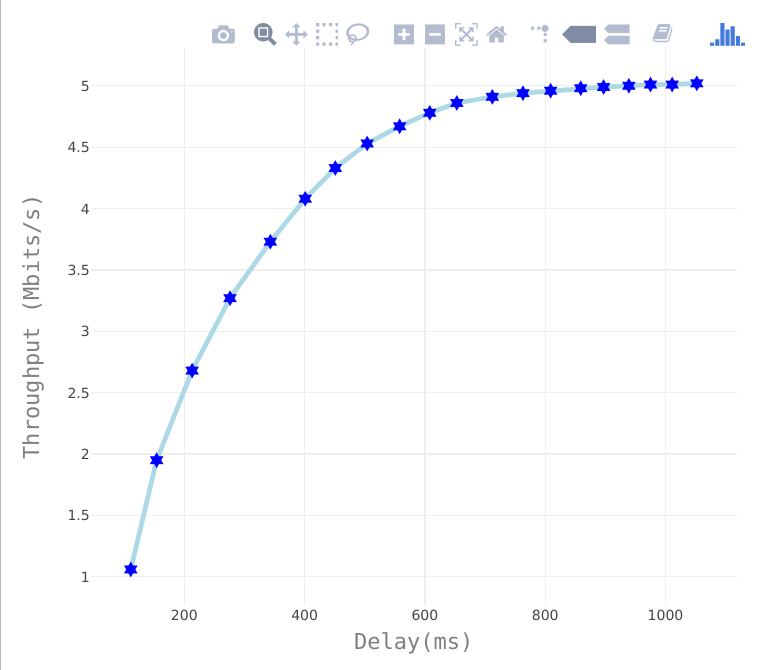
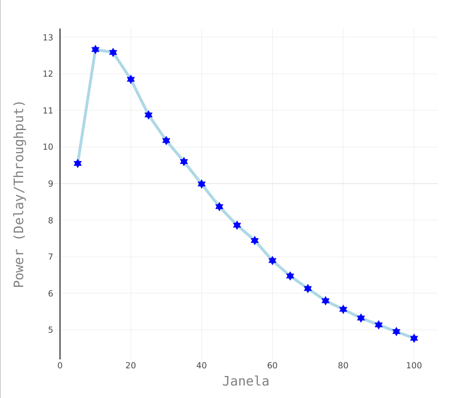
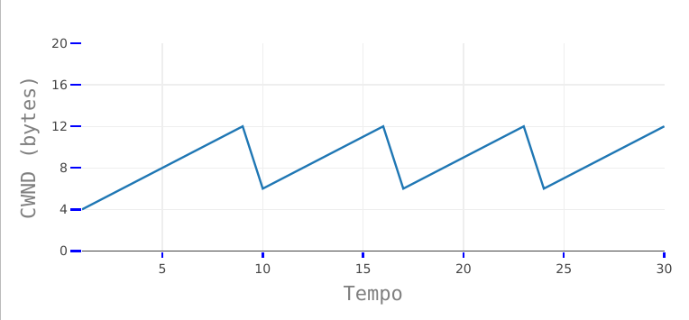
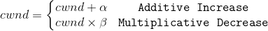
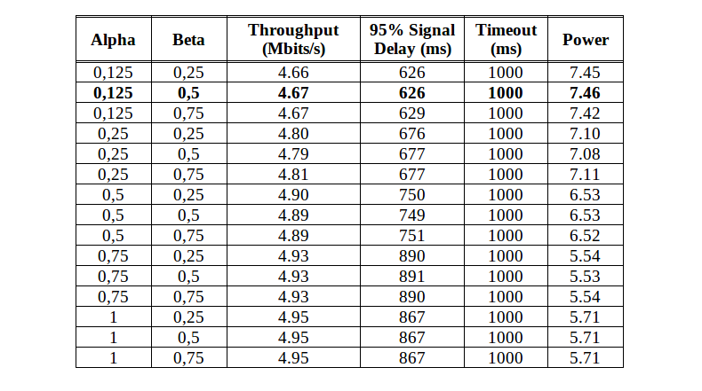
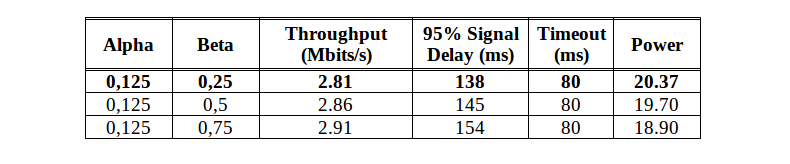
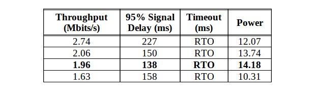
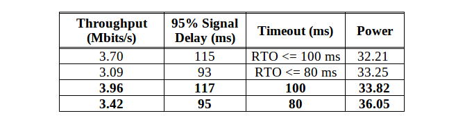

# TP2-Redes
## Exercício A [10%]: Variação do tamanho da janela.
- A variação do tamanho da janela de congestionamento (CWND) utilizada é uma crescente de 5 em 5, começando em 5 até 100. Essa abordagem, de manter a janela com um tamanho fixo não traz muitos benefícios para a transmissão, pois em momentos em que a rede enfrenta um congestionamento e a janela se mantem do mesmo tamanho, o problema é agravado, aumentando ainda mais o atraso (Delay) da rede. Com tudo, com os testes realizados é possível identificar a janela com tamanho 15 como a melhor opção neste cenário, por atingir um melhor Trhoughput e um Delay razoávelmente menor, quando comparado com outras medições. A Figura 1 (à esquerda), demonstra que o Throughput e o Delay crescem em valores de forma proporcional. A Figura 2 (à direita), ilustra a relação entre o tamanho da janela e o *Power* alcançado de cada cenário testado. 

     
    

## Exercício B [40%]: Implementaçã de um esquema AIMD simples.
- O controle de congestionamento tem por função diminuir ou aumentar a taxa de envio dos pacotes de um emissor a fim de evitar um congestionamento no canal utilizado. No início de cada transmissão, o remetente enviará seus pacotes de acordo com o tamanho da janela de congestionamento (CWND) estabelecida e logo em seguida, receberá um reconhecimento dos dados entregues, um sinal de que todos os pacotes foram enviados corretamente, como também o tempo total da operação de envio e confirmação dos dados, esse tempo é conhecido como o tempo de ida e volta, ou RTT. O Additive Increase/Multiplicative Decrease (AIMD), caracterizado como dentes de serra (devido ao seu comportamento graficamente, exemplificado na Figura abaixo) tem por função auxiliar o controle de congestionamento no aumendo gradativo da janela e na redução da mesma pela metade quando um congestionamento é identificado pelo TCP. 

     

- Existem duas fases básicas no algoritmo AIMD: início lento (slow start) e a prevenção de congestionamento (congestion avoidance). O *slow start* é usada no começo de uma transmissão. Nesta fase, a *CWND* aumenta exponencialmente. Depois de atingir um limite (ssthresh), o algoritmo entra no estado de *congestion avoidance* e o tamanho da janela é incrementado de forma mais sutil.

- No experimento realizado, foi utilizado duas variavéis na implementação do AIMD: *alpha* é o parâmetro aditivo para a janela enquanto *beta* é o parâmetro multiplicativo para decrementar a mesma. Dessa forma, a Figura abaixo demonstra a equação para o incremento da janela e a equação utilizada para decrementar o seu tamanho em periodos em que se é detectado um congestionamento. Neste cenário, o congestionamento é identificado após um periodo pré-estabelecido (temporizador) sem receber um reconhecimento (ACK) de um pacote enviado anteriormente e como o cenário utiliza UDP, não há reconhecimentos duplicados, ou *ACK DUP*, pois todos os pacotes recebem um novo valor para o número de sequencia, inclusive os pacotes retransmitidos.

     

- Com o AIMD implementado, os resultados das simulações não apresentaram benefícios para a vazão, entretanto a técnica garante uma utilização mais justa do canal quando há competição pelo link com outros fluxos. A Tabela a seguir apresenta os resultados obtidos a partir da variação dos valores de *alpha* e *beta*. O temporizador de espera (timeout) pelos ACKs nestes primeiros testes com o AIMD manteve um valor fixo de 1 segundo (1000 ms).

     

- Com o auxilio da Tabela anterior, podemos verificar que com um valor de *alpha* menor, o que resulta em um aumento menos agressivo para a janela de congestionamento, o desempenho foi melhor (*Power*) quando comparado com outros valores que fazem com que a janela cresça de forma mais expressiva a cada ACK recebido. Em contra partida, o mecanismo obteve um pior desempenho quando comparado ao experimento anterior, com as janelas de tamanho fixo. Como pode ser observado na Tabela abaixo, o melhor cenário atingiu um valor para *Power* de 7.46, enquanto a janela de tamanho fixo com valor de 10 e de 15 do exercicio A atingiram valores aproximados à 12. 

- Evidente a necessidade do mecanismo por questões de justiça de utilização do canal, mas a qualidade do modelo implementado é pobre, principalmente quando há muita concorrência pelo canal, pois reduz a janela várias vezes, chegando a transmitir um pacote por vez. Uma forma simples de melhorar o desempenho da conexão é diminuindo o tempo de *Timeout*, ou seja, o tempo esperado pelo recebimento do ACK. Com o *Timeout* configurado em 80ms o desempenho melhorou expressivamente e pode ser observado na Tabela abaixo.

     

## Exercício D [50%]: Trabalhe para maximizar a potência.

- Para melhorar o desempenho do AIMD do exercicio anterior, bastou diminuir o temporizador de espera pelo reconhecimento do pacote enviado. O ganho em *power* para a transmissão foi bastante significativo quando este temporizador foi configurado para *80 ms* ao invés de 1 segundo. A fim de melhorar ainda mais os resultados, adicionamos o calculo de RTO (Rertransmission Timeout) conforme descrito na [RFC 6298](https://tools.ietf.org/html/rfc6298). 

- O RTO varia de acordo com o RTT. Ele traz maior dinamicidade para a transmissão e proporciona um menor delay. Contudo, pequenas variações do RTT podem reduzir a janela pela metade, diminuindo significativamente o Throughput total da transmissão. Com a adição do cálculo do RTO e algumas variações de alpha e beta no código chegamos aos seguintes resultados;

     

- Com o cálculo de RTO, não foi possível melhorar o desempenho da transmissão comparado com o Timeout de valor fixo em 80 ms. Assim, a abordagem adotada foi diminuir a ação do *Multiplicative Decrease* adicionando um contador para o número de retransmissões. Quando um congestionamento é identificado, a CWND é reduzida pela metade conforme o AIMD padrão, porem se mantem com este tamanho por mais tempo, à espera de uma redução do Delay sem afetar muito o Throughput, caso o RTT não estabilize a janela é reduzida novamente pela metade e mantém esse valor por mais um periodo de tempo. O resultado final do experimento pode ser observado na tabela logo abaixo, duas abordagens com variações do cálculo do RTO com a adição de um limitador, forçando o RTO ser um valor abaixo de 80 e 100 ms e outra com o Timeout fixo com ambos os valores. 

     

## Exercício E [0%]: escolha um nome legal para o seu esquema!

FredMercury (FM) ;D 

