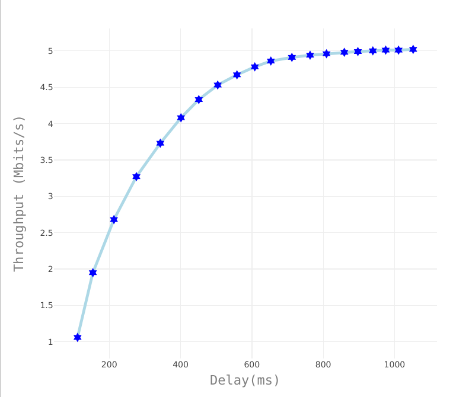

# TP2-Redes
## Exercício A [10%]: Variação do tamanho da janela.
- A variação do tamanho da janela foi uma crescente de 5 em 5, começando em 5. Essa abordagem, de manter a janela com um tamanho fixo não traz muitos beneficios para a transmissão, pois em momentos em que a rede enfrenta um congestionamento e a janela se mantem do mesmo tamanho, o problema é agravado, aumentando ainda mais o **delay** da rede. Porem, com os testes realizados, é possivel identifar a janela com tamanho 15 como a melhor opçao neste cenário, por atingir um melhor trhoughput e um delay razoávelmente menor, quando comparado com outras medições. A Figura 1 ([Link para melhor vizualização](https://plot.ly/~paulogil2010/15/#/)), demonstra que o Throughput e o Delay crescem em valores de forma proporcional. A
Figura 2 ([Link para melhor vizualização](https://plot.ly/~paulogil2010/13/#/)), ilustra a relação entre o tamanho da janela e o "power" alcançado de cada cenário testado.

     
    

## Exercício B [40%]: Implementaçã de um esquema AIMD simples.
- O controle de congestionamento tem por função limitar ou aumentar a taxa de envio dos pacotes de um emissor a fim de evitar um congestionamento no canal utilizado. Ao início de cada RTT (tempo de ida e volta) o remetente enviará seus pacotes de acordo com o tamanho da janela de congestionamento (**CWND**) estabelecida e ao final, receberá um reconhecimento para dos dados, um sinal de que todos os pacotes foram enviados corretamente. O Additive Increase/Multiplicative Decrease (**AIMD**), também conhecidos como dentes de serra (devido ao seu comportamento graficamente, Figura 3) tem por função auxiliar o controle de congestionamento no aumendo gradativo da janela e na redução da mesma pela metade quando um congestionamento é identificado pelo TCP. 

     

- Existem duas fases básicas no algoritmo AIMD: início lento (**slow start**) e a prevenção de congestionamento (**congestion avoidance**). O *slow start* é geralmente usada no começo de uma conexão. Nesta fase, a **CWND** aumenta exponencialmente. Depois de atingir um limite (**ssthresh**), o algoritmo entra no estado de *congestion avoidance* e durante este periodo, o tamanho da janela é incrementado de forma mais sutil.

- No experimento realizado, ***alpha*** é o parâmetro aditivo para a janela enquanto ***beta*** é o parâmetro multiplicativo para decrementar a mesma. Os valores recomendados pela RFC para ambos os parâmetros são: alpha = 1/8 (12.5%) e beta = 1/4 (25%). Dessa forma, a Tabela abaixo demonstra a equação para o incremento da janela em periodos de *slow start* e a equação utilizada para decrementar o tamanho da janela em periodos em que é detectado um congestionamento, neste caso, o congestionamento é identificado após um periodo pré-estipuldo sem receber um reconhecimento (ACK) de um pacote enviado anteriormente e como o cenário utiliza UDP, não há reconhecimentos duplicados, ou **ACK DUP**, pois todos os pacotes recebem um novo valor para o número de sequencia, inclusive os pacotes retransmitidos.

Additive Increase             |  Multiplicative Decrease
:-------------------------:|:-------------------------:
  |  

- O AIMD não apresentou beneficios tão expressivos para a vazão, entretanto a técnica garante uma utilização mais justa do canal quando há competição do link com outros fluxos. A Tabela a seguir apresenta os resultados obtidos a partir da variação dos valores de *alpha* e *beta*. O **timeout** de espera pelo ACK e ssthresh foram mantidos em ...

• Exercício D [50%]: Tente diferentes abordagens e trabalhe para maximizar a
potência (compare com os resultados dos demais colegas da sala e tente melhorar).
Em seu relatório, explique sua abordagem, incluindo as decisões importantes
que você teve que tomar e como você as fez. Inclua gráficos ilustrativos
com os resultados.

• Exerc´ıcio E [0%]: escolha um nome legal para o seu esquema!

